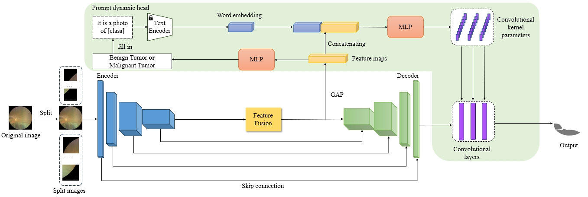

# FTSNet

Here is the official implementation of the FTSNet code, you can run the mian function directly to train the whole network, and the various initial settings of the network can be modified in the code.

